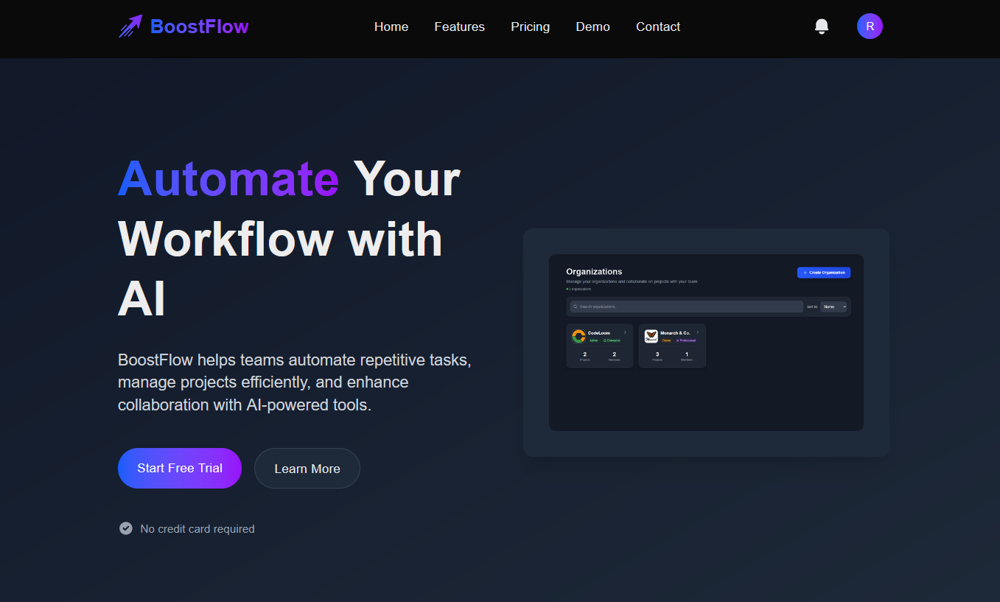
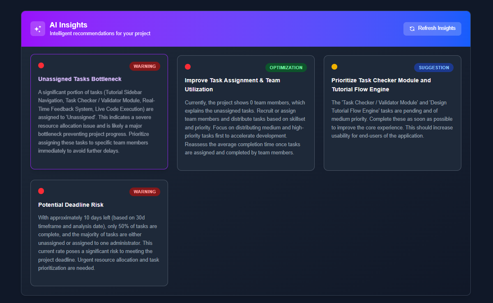
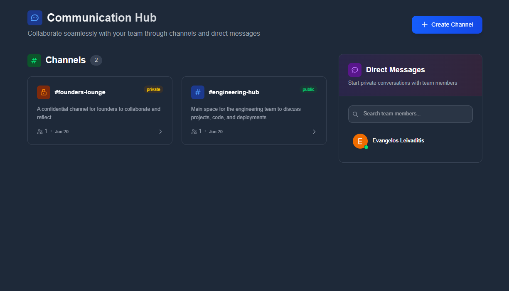
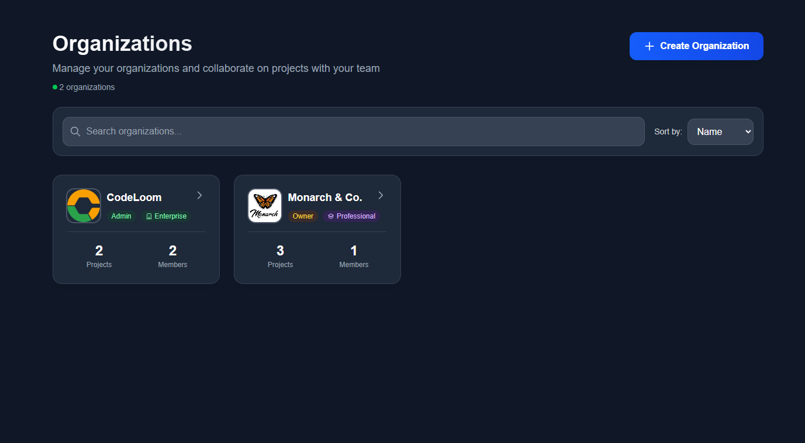
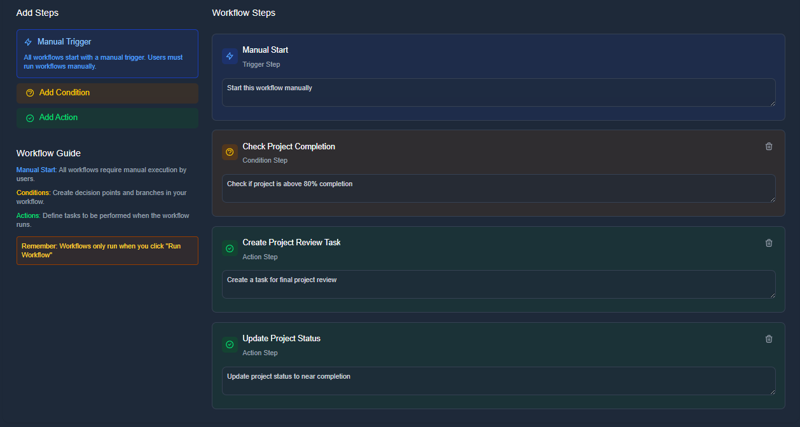

# BoostFlow


<div align="center">
  
</div>

BoostFlow is an AI-powered productivity platform designed to help teams automate repetitive tasks, manage projects efficiently, and enhance collaboration across organizations of all sizes.

### Home Page


## Features

- **Task Management**: Comprehensive task organization and tracking tools with AI-powered insights to help teams prioritize work, manage deadlines, and optimize productivity
- **AI-Powered Analytics**: Get intelligent insights about project performance with AI that analyzes task patterns, team productivity, and identifies optimization opportunities
- **Team Collaboration**: Connect your team with powerful communication tools including organized channels, direct messaging, and real-time collaboration features
- **Project Management**: Comprehensive project management tools with timeline tracking, budget management, and client information
- **Advanced Security**: Security features to protect sensitive data and ensure compliance
- **Customizable Workflows**: Tailor BoostFlow to your team's unique needs with flexible and customizable workflows
- **Integration Ecosystem**: Seamlessly connect with your favorite tools and services
- **Multiple Organizations**: Support for multiple organizations with role-based access control
- **File Management**: Secure file upload, storage, and sharing capabilities
- **Real-time Notifications**: Stay updated with instant notifications and alerts

## Screenshots

Explore BoostFlow's intuitive interface and powerful features through these screenshots:

### AI Analytics


*AI-powered analytics providing insights into team productivity and project performance*

### Communication Hub


*Team collaboration tools with organized channels and real-time messaging*

### Organizations Management


*Multi-tenant organization management with role-based access control*

### Workflow Automation


*Customizable workflow automation tools for streamlining repetitive tasks*

## Getting Started

Follow these steps to get up and running with BoostFlow quickly.

### 1. Create Your Account

Visit the signup page and follow the instructions to create your account.

### 2. Create Your Organization

After creating your account, you'll need to create or join an organization. Organizations are the main workspace where you'll manage your projects, tasks, and team members.

- Choose a subscription plan (Free, Starter, Professional, or Enterprise)
- Give your organization a name and description
- Upload your company logo and set up branding
- Configure organization settings

### 3. Invite Team Members

Build your team by inviting members to your organization with different roles and permissions:

1. Navigate to the Team section in your organization
2. Click "Invite Members" and enter email addresses
3. Assign roles: Owner, Admin, Member, or Viewer
4. Set permissions and access levels
5. Send invitations to your team members

### 4. Create Your First Project

Projects are where you organize work within your organization. To create your first project:

1. Navigate to the Projects section in your organization
2. Click "New Project" and enter project details
3. Set project timeline, budget, and client information
4. Assign team members and define their roles
5. Start adding tasks and setting up workflows
6. Configure automation and integrations as needed

## Development

This project is a Next.js application with a Firebase backend and modern web technologies.

### Technology Stack

- **Next.js 15**: React framework for building web applications with App Router
- **React 19**: Latest version of React with modern features
- **TypeScript**: Strongly typed JavaScript for better development experience
- **Firebase**: Backend services including Authentication, Firestore, and Storage
- **Tailwind CSS 4**: Utility-first CSS framework for rapid UI development
- **Firebase Admin**: Server-side Firebase operations
- **Chart.js**: Data visualization library
- **SendGrid**: Email service integration
- **Google Generative AI**: AI-powered features
- **MinIO**: Object storage service
- **React Google Maps**: Google Maps integration

### Prerequisites

- **Node.js** (version 18 or higher)
- **npm**
- **Git**
- **Firebase Project** (for backend services)

### Installation

1. **Clone the repository:**

   ```bash
   git clone https://github.com/your-repo/BoostFlow.git
   cd BoostFlow
   ```

2. **Install dependencies:**

   ```bash
   npm install
   ```

3. **Set up environment variables:**

   Create a `.env.local` file in the root directory and add your configuration variables:

   ```env
   # Google Maps Configuration
   NEXT_PUBLIC_GOOGLE_MAPS_API_KEY=your_google_maps_api_key

   # Firebase Configuration
   NEXT_PUBLIC_FIREBASE_API_KEY=your_firebase_api_key
   NEXT_PUBLIC_FIREBASE_AUTH_DOMAIN=your_project.firebaseapp.com
   NEXT_PUBLIC_FIREBASE_PROJECT_ID=your_project_id
   NEXT_PUBLIC_FIREBASE_STORAGE_BUCKET=your_project.appspot.com
   NEXT_PUBLIC_FIREBASE_MESSAGING_SENDER_ID=your_sender_id
   NEXT_PUBLIC_FIREBASE_APP_ID=your_app_id
   NEXT_PUBLIC_FIREBASE_MEASUREMENT_ID=your_measurement_id

   # Firebase Service Account (Server-side only)
   FIREBASE_SERVICE_ACCOUNT_KEY=your_firebase_service_account_json

   # OAuth Configuration
   NEXT_PUBLIC_GOOGLE_CLIENT_ID=your_google_client_id
   NEXT_PUBLIC_GOOGLE_CLIENT_SECRET=your_google_client_secret
   NEXT_PUBLIC_GITHUB_CLIENT_ID=your_github_client_id
   NEXT_PUBLIC_GITHUB_CLIENT_SECRET=your_github_client_secret
   
   # Server-side OAuth secrets (not exposed to client)
   GOOGLE_CLIENT_SECRET=your_google_client_secret
   GITHUB_CLIENT_SECRET=your_github_client_secret
   GOOGLE_CLIENT_ID=your_google_client_id
   GITHUB_CLIENT_ID=your_github_client_id
   
   # General OAuth Configuration
   NEXT_PUBLIC_OAUTH_CLIENT_ID=your_oauth_client_id

   # MinIO Configuration
   MINIO_ENDPOINT=your_minio_endpoint
   MINIO_EXTERNAL_ENDPOINT=your_minio_external_endpoint
   MINIO_PORT=9000
   MINIO_ROOT_USER=your_minio_root_user
   MINIO_ROOT_PASSWORD=your_minio_root_password
   MINIO_USE_SSL=false

   # MinIO Bucket Names
   MINIO_PROFILE_PICTURES_BUCKET=profile-pictures
   MINIO_PROJECT_DOCUMENTS_BUCKET=project-documents

   # Email Configuration (Development - MailHog)
   MAILHOG_HOST=localhost
   MAILHOG_PORT=1025
   DEFAULT_FROM_EMAIL=noreply@yourdomain.com

   # Email Configuration (Production - SendGrid)
   SENDGRID_API_KEY=your_sendgrid_api_key
   DEFAULT_FROM_EMAIL=noreply@yourdomain.com

   # Application Configuration
   NODE_ENV=development
   NEXT_PUBLIC_APP_URL=https://yourdomain.com
   ```

### Running the Application

#### Production Build (Test)

To build the application for production:

```bash
npm run build
```

#### Development Mode

To run the application in development mode:

```bash
npm run dev
```

The application will start and be available at `http://localhost:3000` by default.


## Database Information

BoostFlow uses Firebase Firestore as its primary database. No additional database installation is needed locally. The application will connect to Firestore automatically when started with proper configuration.

### Firebase Services Used

- **Authentication**: User authentication and authorization
- **Firestore**: NoSQL document database for application data
- **Storage**: File storage for documents, images, and other assets
- **Cloud Functions**: Server-side logic

## Project Structure

```
src/
├── app/                    # Next.js App Router pages
│   ├── api/               # API routes
│   ├── organizations/     # Organization management
│   ├── auth/             # Authentication pages
│   ├── features/         # Feature showcase
│   └── platform-admin/   # Admin panel
├── components/           # Reusable React components
├── lib/                 # Utility functions and configurations
│   ├── firebase/        # Firebase configuration
│   └── hooks/          # Custom React hooks
└── middleware/         # Next.js middleware
```

## Key Features Implementation

### Authentication
- Firebase Authentication with email/password
- OAuth integration (Google, GitHub)
- Role-based access control
- Email verification system

### Organizations & Projects
- Multi organization support
- Project management with timelines and budgets
- Team member invitation system
- File upload and document management

### AI Integration
- Google Generative AI for insights and automation
- Project analytics and performance tracking
- Automated task suggestions

### Communication
- Real-time notifications
- Team collaboration tools
- Email integration with SendGrid

## Security Features

- Firebase Security Rules for data protection
- Role-based access control
- Secure file upload with validation
- Environment variable protection
- HTTPS enforcement in production

## Authors

- **Dimitris Koutsompinas** @KDim67
- **Evangelos Leivaditis** @EvanLei-git
- **Nikolaos Douros** @nikosd767

---

**Note**: Make sure to configure all environment variables properly before running the application. The application requires active Firebase project and proper API keys for full functionality.
